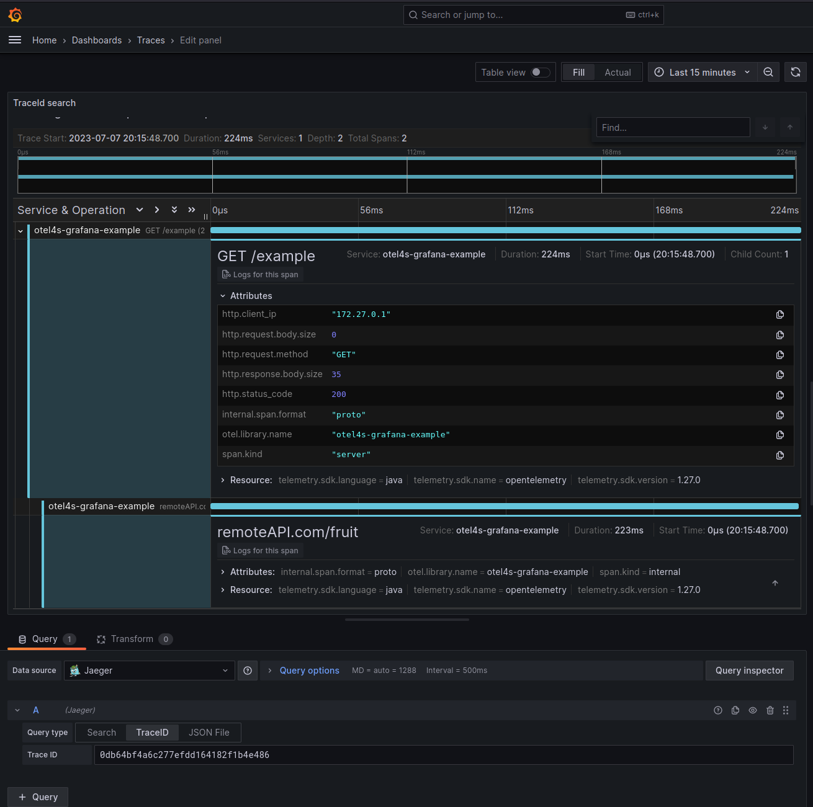
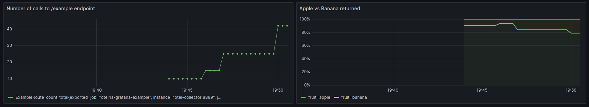
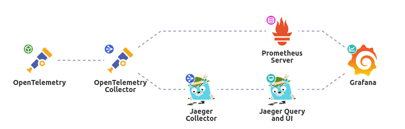

# Simple otel4s with grafana example

```
# Build the application & locally publish the docker image
sbt "Docker / publishLocal"

# Spin up the docker containers
docker-compose up -d

# Test it out!
curl -v localhost:8080/example
```

In Grafana (http://localhost:3000/explore), login using user `admin` and password `admin`.
Then in the Explore page, you can select `Prometheus` to view metrics or `Jaeger` to view traces

### 1. The code

Before diving into the configuration let's review the code in order to understand what we are monitoring: we have a simple http4s server with a route on `/example`. This route then calls `ExampleService` which emulates a call to a remote API, supposed to return apples or bananas.

I made the ExampleService configurable to adjust the simulated latency as well as the amount of bananas vs apple returned:

```scala
  def apply[F[_]: Async: Tracer: Meter: Random](
      minLatency: Int,
      maxLatency: Int,
      bananaPercentage: Int
  ): ExampleService[F] 
```

### 2. The traces
Starting from here we can make pretty simple spans, one inside a middleware staring when a call is received on our endpoint, and another to wrap the call to our remote API.

For the middleware I pretty much reused the implementation done by Ivan Kurchenko in this [very good blog article](https://ivan-kurchenko.medium.com/telemetry-with-scala-part-3-otel4s-c5c150303164).




### 3. The metrics

When it comes to metrics there's endless possibilities, so for the sake of example I tried to keep things as simple as possible:
- A counter incremented everytime the endpoint is called, which allows us to calculate the rate per minute for example.
- The amount of bananas vs apples returned, which allows us to build a 100% stacked chart to see if the results we get correspond to the bananaPercentage we've put as parameter.



### 4. The configuration

The configuration uses the OpenTelemetry collector to receive metrics and traces. The traces are then sent to jaeger while the metrics are then sent to prometheus.

Everything can be then visualized in grafana.



